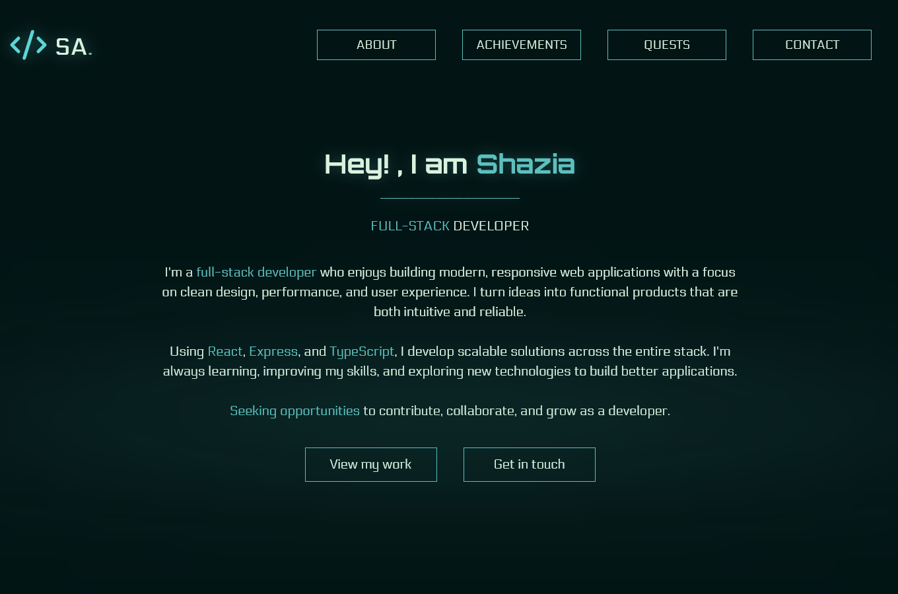
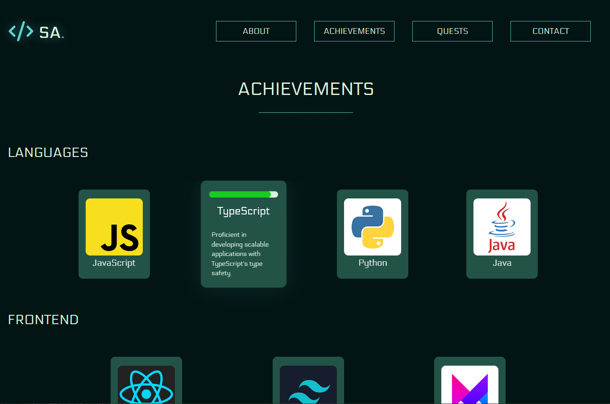
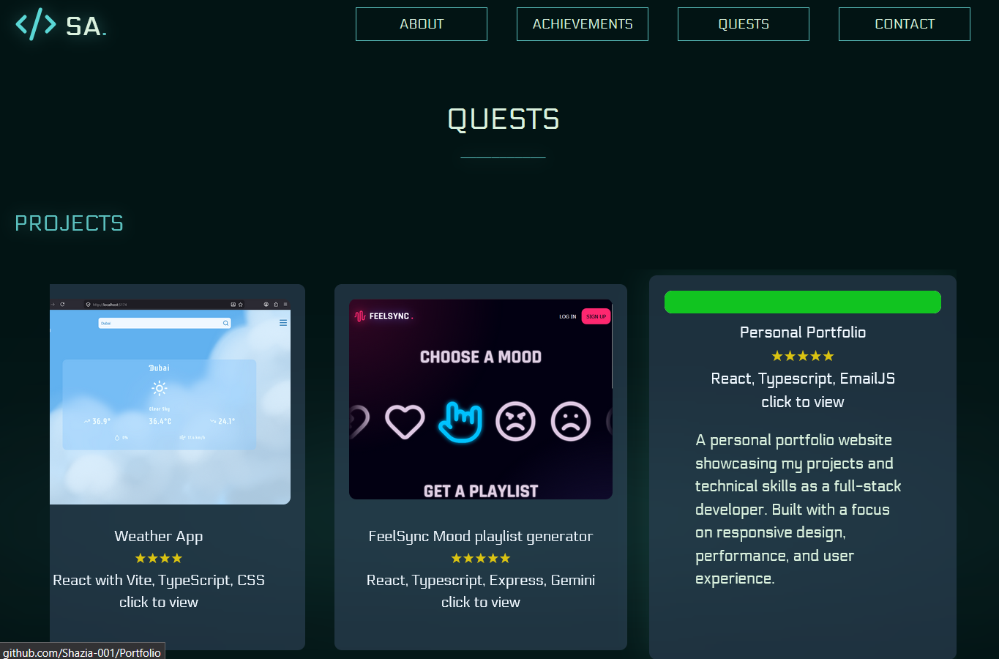
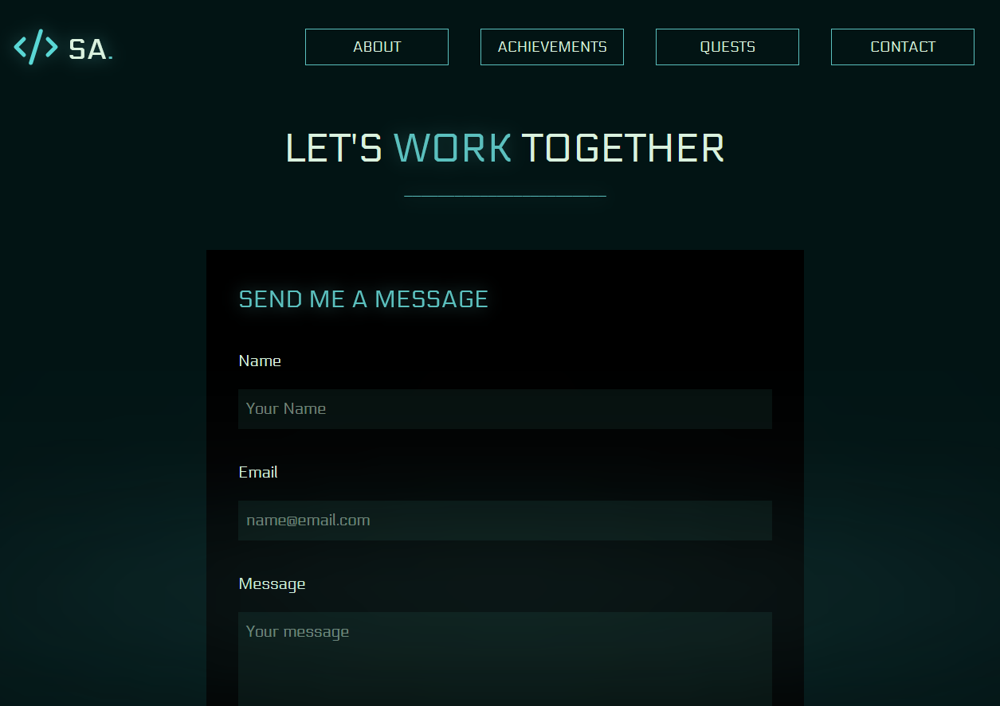

# Personal Portfoli

A personal portfolio website showcasing my projects and technical skills as a full-stack developer. Built with a focus on responsive design, performance, and user experience.

## About Me

## Skills / Achievements
Named Achievements like badges in game when hovering on one it shows the percentage bar of how much i know and description.

## Quests
Named Quest as this page showcases my personal projects, and other projects i have done as quests when hovered over it shows the project description and the bar of how much completed. When clicked on, you are redirected to the github repo.

## Contact Page

## Features 
- Multi-page navigation using React Router
- Project showcase
- Skills section
- Contact form with EmailJS integration
- Responsive design
- Game-inspired UI elements and interactions
- Smooth navigation between sections

## Tech Stack
### Frontend
- React
- TypeScript
- CSS
- Lucide React
### Backend
- Express.js
### Planned Integrations
- Gemini API

## Project Goals

The goal of this project is to explore how AI-powered recommendations can create a personalized entertainment experience based on a user's emotional state.

## What I'm Learning
- Full-stack application development
- REST API design with Express
- State management in React
- TypeScript best practices
- Data persistence and user preferences
- AI integration workflows

## Planned Improvements
- Gemini-powered recommendation generation
- User authentication
- Custom playlist creation
- Recommendation history
-Favorites system
- Enhanced recommendation accuracy